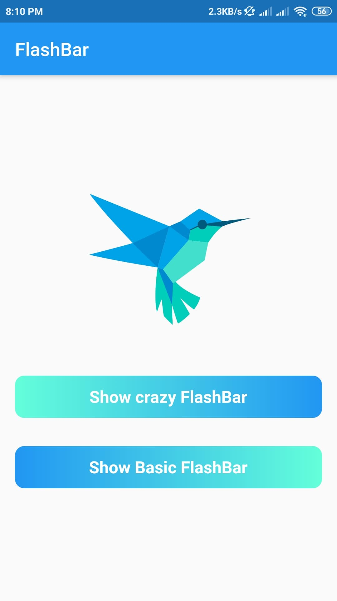
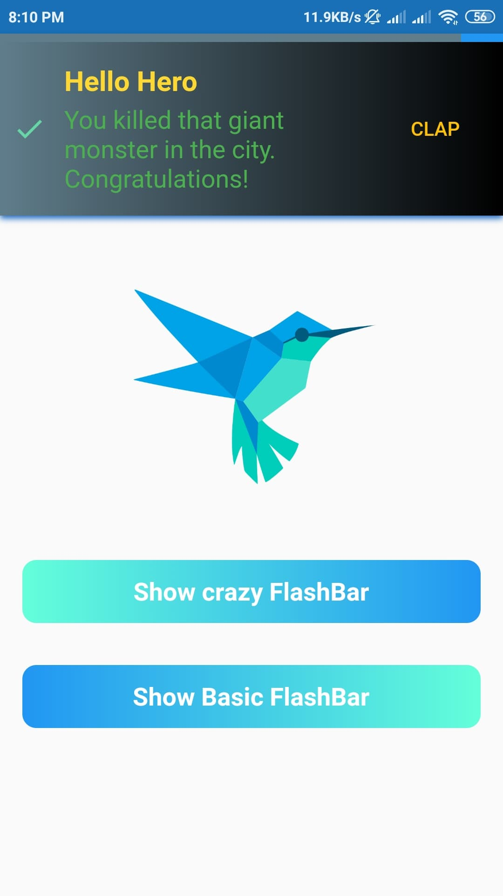
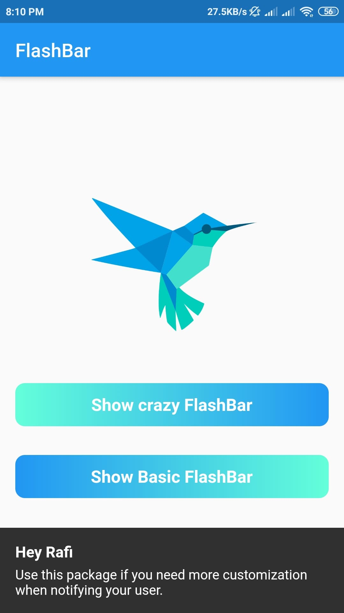

# Flushbar Flutter

This project is for learning how to use basic flushbar and crazy flushbar widget in Flutter App.

### Flushbar Package

```dart
dependencies:
  flushbar: ^1.10.4
```

```dart
$ flutter pub get
```

```dart
import 'package:flushbar/flushbar.dart';
```

### Basic Flashbar
```dart
Flushbar(
      title: "Hey Rafi",
      message:
          "Use this package if you need more customization when notifying your user.",
      duration: Duration(seconds: 3),
    )
```

### Crazy Flashbar
```dart
Flushbar(
      title: "Hey Ninja",
      message: "Lorem Ipsum is simply dummy text of the printing and typesetting industry",
      flushbarPosition: FlushbarPosition.TOP,
      flushbarStyle: FlushbarStyle.FLOATING,
      reverseAnimationCurve: Curves.decelerate,
      forwardAnimationCurve: Curves.elasticOut,
      backgroundColor: Colors.red,
      boxShadows: [BoxShadow(color: Colors.blue[800], offset: Offset(0.0, 2.0), blurRadius: 3.0)],
      backgroundGradient: LinearGradient(colors: [Colors.blueGrey, Colors.black]),
      isDismissible: false,
      duration: Duration(seconds: 4),
      icon: Icon(
        Icons.check,
        color: Colors.greenAccent,
      ),
      mainButton: FlatButton(
        onPressed: () {},
        child: Text(
          "CLAP",
          style: TextStyle(color: Colors.amber),
        ),
      ),
      showProgressIndicator: true,
      progressIndicatorBackgroundColor: Colors.blueGrey,
      titleText: Text(
        "Hello Hero",
        style: TextStyle(
            fontWeight: FontWeight.bold, fontSize: 20.0, color: Colors.yellow[600], fontFamily: "ShadowsIntoLightTwo"),
      ),
      messageText: Text(
        "You killed that giant monster in the city. Congratulations!",
        style: TextStyle(fontSize: 18.0, color: Colors.green, fontFamily: "ShadowsIntoLightTwo"),
      ),
    );
```

## Screenshots
 &nbsp;&nbsp;&nbsp;&nbsp;&nbsp;&nbsp;&nbsp;&nbsp;&nbsp;&nbsp;  &nbsp;&nbsp;&nbsp;&nbsp;&nbsp;&nbsp;&nbsp;&nbsp;&nbsp;&nbsp; 
